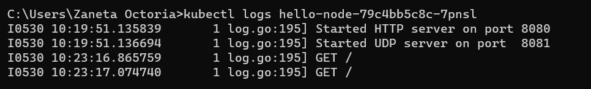

# Reflection Hello Minikube

### 1. Compare the application logs before and after you exposed it as a Service.

**Before:**


**After:**


There is a noticeable difference in the logs before and after exposing the application as a Service. After exposing, the logs include additional entries that show which endpoints were accessed on the localhost IP, along with the HTTP methods used. The number of log entries corresponds to how many times the service was accessed.

---

### 2. Notice that there are two versions of the `kubectl get` command used in this tutorial. The first version has no options, while the second uses the `-n` option with the value `kube-system`. What is the purpose of the `-n` option, and why didn't the output list the pods/services you explicitly created?

The `-n` option in the `kubectl get` command specifies the namespace in which Kubernetes should search for resources like pods, services, etc.

By default, when you run `kubectl get` without the `-n` option, Kubernetes looks in the `default` namespace. However, when using `-n kube-system`, Kubernetes searches in the `kube-system` namespace instead, which is a special namespace used for system components and internal services like `kube-dns` and `kube-proxy`. That’s why the output didn’t include the pods or services you created — they were created in the `default` namespace, not in `kube-system`.

Here is the paraphrased English version of your reflection:

---

# Reflection on Rolling Update & Kubernetes Manifest File

#### **1. What is the difference between the Rolling Update and Recreate deployment strategies?**

**Rolling Update** is the default deployment strategy in Kubernetes, where pods are updated gradually. New pods are created and started **before** the old ones are terminated. This process continues step-by-step until all old pods are replaced. The main advantage of Rolling Update is that it avoids downtime, ensuring the application remains available throughout the update. It's ideal for high-availability applications that can handle running both old and new versions simultaneously.

**Recreate**, on the other hand, is a strategy where **all old pods are terminated first** before new ones are created. This results in a temporary downtime during the transition when no pods are running. Recreate is more suitable for applications that can't support running multiple versions at once or when the changes are so significant that starting fresh is safer. While simpler, Recreate is not ideal for apps that require continuous availability.

---

#### **2. Try deploying the Spring Petclinic REST app using the Recreate strategy and document your process.**

**Create a Deployment via CLI:**

```bash
kubectl create deployment spring-petclinic-recreate \
  --image=springcommunity/spring-petclinic-rest \
  --dry-run=client -o yaml > spring-petclinic-recreate-deployment.yaml
```

**Edit the YAML to set Recreate strategy:**

```bash
vi spring-petclinic-recreate-deployment.yaml
```

```yaml
# spring-petclinic-recreate-deployment.yaml
apiVersion: apps/v1
kind: Deployment
metadata:
  labels:
    app: spring-petclinic-recreate
  name: spring-petclinic-recreate
spec:
  strategy:
    type: Recreate
  replicas: 1
  selector:
    matchLabels:
      app: spring-petclinic-recreate
  template:
    metadata:
      labels:
        app: spring-petclinic-recreate
    spec:
      containers:
      - image: springcommunity/spring-petclinic-rest
        name: spring-petclinic-rest
```

**Apply the deployment to the cluster:**

```bash
kubectl apply -f spring-petclinic-recreate-deployment.yaml
```

**Expose the deployment as a LoadBalancer:**

```bash
kubectl expose deployment spring-petclinic-recreate --type=LoadBalancer --port=9966
```

**Check the pod status:**

```bash
kubectl get pods
kubectl describe pods
```

---

#### **3. Prepare different manifest files to execute the Recreate deployment strategy.**

As demonstrated above, I’ve created the `spring-petclinic-recreate-deployment.yaml`. Afterward, I generated a service file using this command:

```bash
kubectl get services/spring-petclinic-recreate -o yaml > spring-petclinic-recreate-service.yaml
```

---

#### **4. What are the benefits of using Kubernetes manifest files?**

In Kubernetes-based application management, manifest files offer several key advantages—especially within modern, structured software development. Manifest files are **declarative**, meaning you simply define the desired end state of your application (such as the number of pods, the container image, deployment strategy, etc.), and Kubernetes automatically adjusts the cluster to match that state. This ensures consistency across environments like development, staging, and production.

Moreover, these files can be stored in version control systems like Git, making all configurations traceable, reversible in case of errors, and manageable collaboratively by teams. In DevOps and CI/CD practices, manifest files are essential for automating deployments via pipelines (e.g., GitHub Actions), enabling faster releases with fewer errors and minimal manual effort. They also enhance application portability, allowing the same configurations to be reused across different clusters without major changes.
